# E-commerce Application Documentation

## Task Description
The developed application serves as an e-commerce platform for a company specializing in the retail of Laptops, TVs, Phones, Tablets, Kitchen Appliances, Consumer Electronics, and Gaming devices.

The application features user and admin login options.

Users can create accounts, providing essential details such as: name, email, phone, and address. Unique username and email are required, with alerts for duplicates or missing information. Upon successful registration, users can log in.

## User Interface
### Home Page
The Home Page contains a menu with the following buttons: Home Page, Products, Category, Cart, Orders, and Log Out.

### Navigation
- **Home Page:** Main landing page of the online shopping site.

- **Products:** Alphabetical list of all items available.
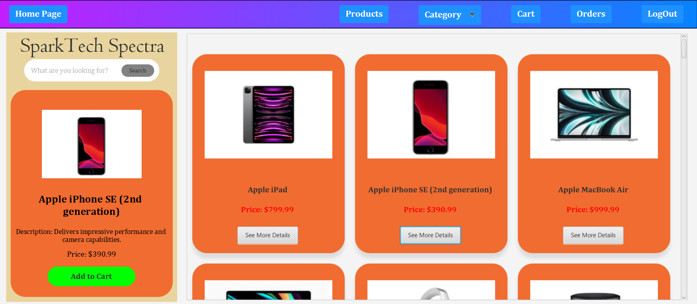
- **Category:** Select from available shopping market sections.
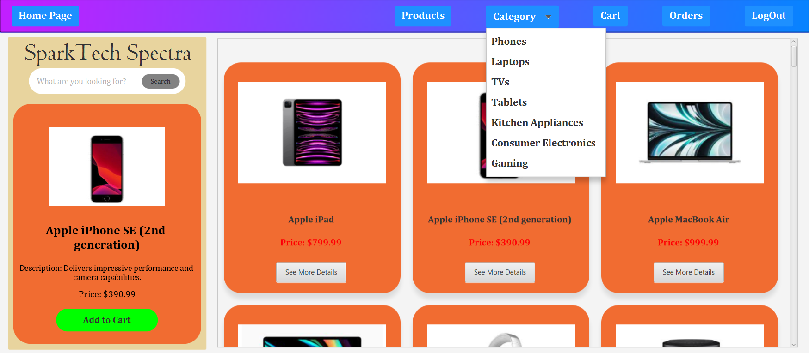
- **Cart:** View and manage products in the cart.
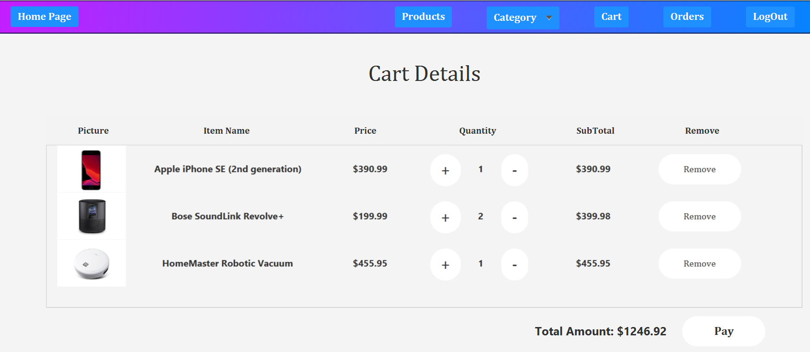
- **Orders:** View order history and details.
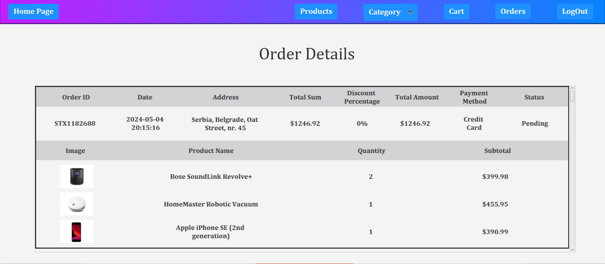
- **Log Out:** Log out of the application.

## Shopping Flow
1. **Products:** Users can browse products and add them to the cart.
2. **Cart:** Review products, adjust quantities, and proceed to checkout.
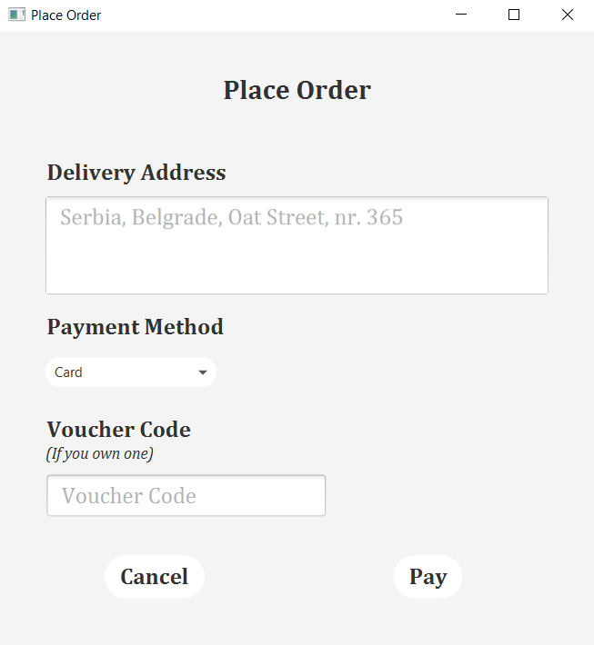
3. **Checkout:** Enter delivery address, select payment method, apply vouchers, and finalize the order.
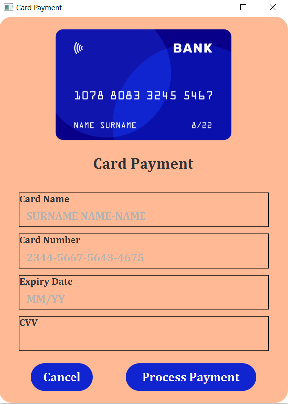

## Admin Interface
Admins have access to advanced options including:
- **Home Page**

- **Products:** View, update, or remove items.
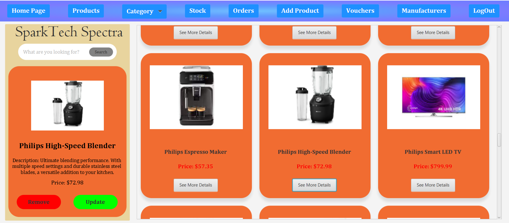
- **Category**
- **Stock:** View and manage product details.
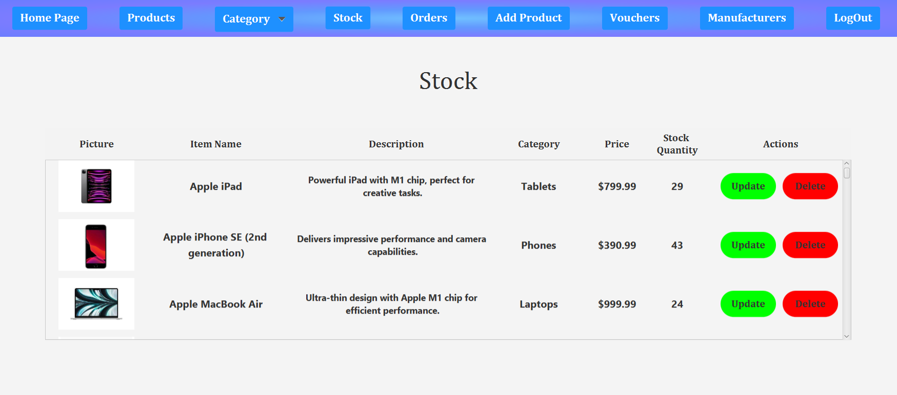
- **Orders:** Manage order status.
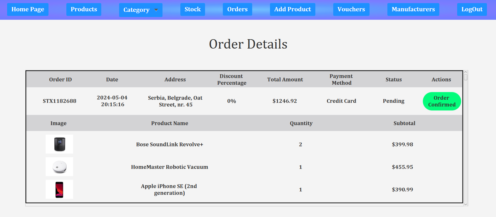
- **Add Product:** Add new items to the stock.
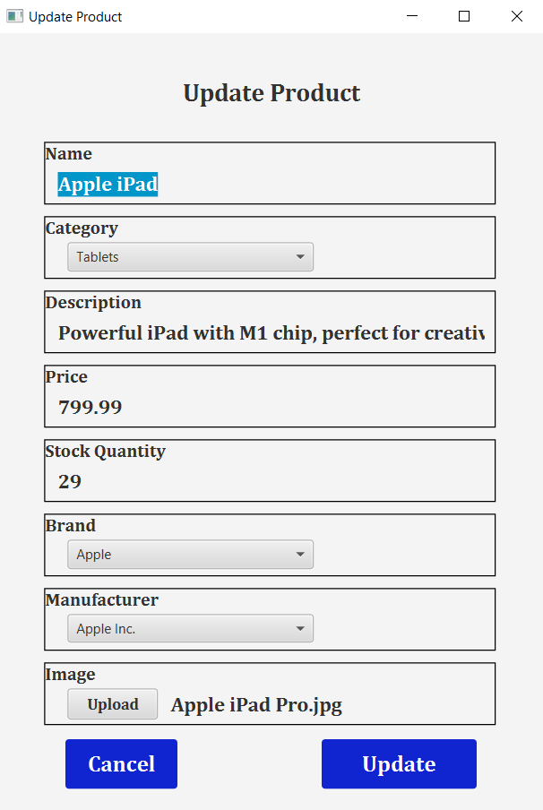
- **Vouchers:** Create and manage discount vouchers.
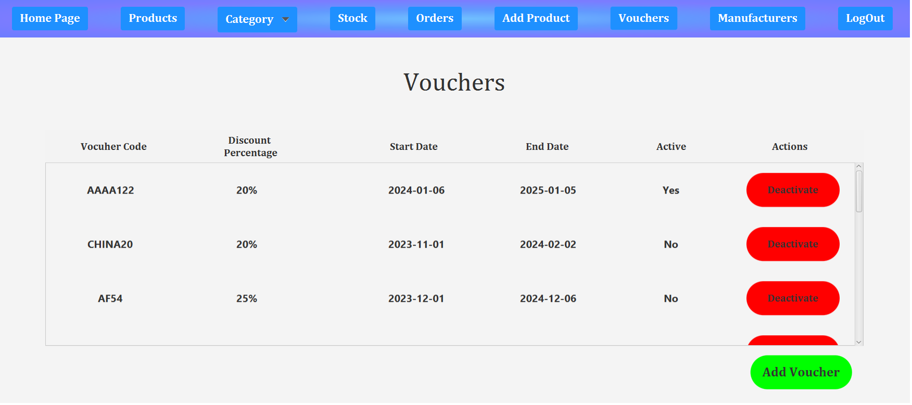
- **Manufacturers:** View manufacturing partners' details.
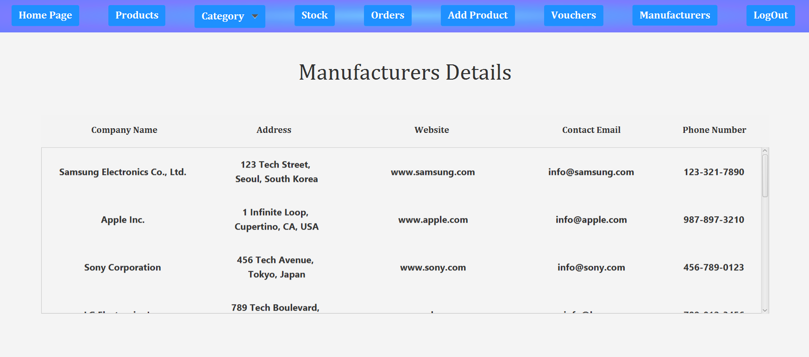
- **Log Out**

## Order Management
Order status changes include: Pending, Order Confirmed, Shipped, Out for Delivery, and Delivered.

## Adding Products
Admins can add new products with details such as name, brand, manufacturer, category, description, price, available stock, and image.

## Managing Vouchers
Admins can create, activate, deactivate, and view details of discount vouchers.

## Login and Registration
The application features user and admin login options.
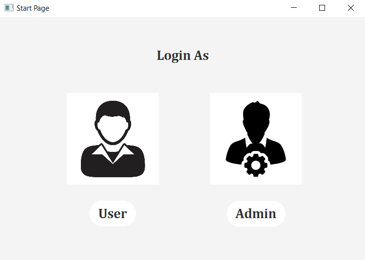

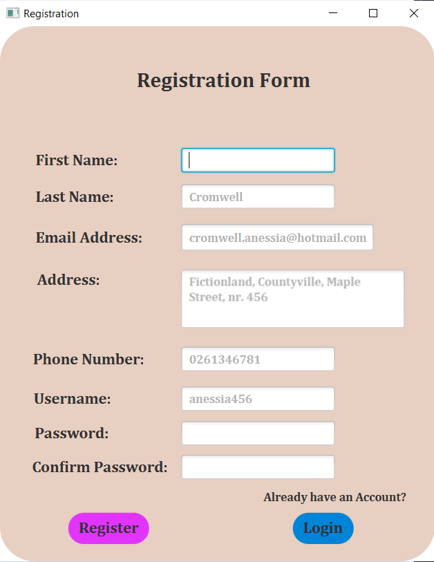

## README
For detailed instructions on setting up and running the application, please refer to the README.md file.

